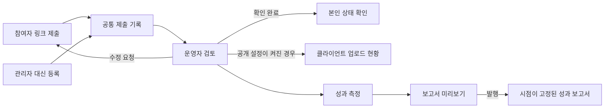

# 챌린지 게시물 제출·업로드 운영 기획안

작성일: 2026-09-07.
상태: 구현 완료·운영 반영 대기이며, 최종 구현과 검증 범위는 `docs/campaign-submissions-implementation.md`를 참조한다.
기존 구현 확인 기준: 로컬 `origin/main`의 `fab3e76`와 캠페인·챌린지 운영 메모리.

기존 캠페인 성과 도구에 ‘제출 현황’을 추가하고, 참여자 화면과 클라이언트 보드를 같은 게시물 기록에 연결한다.
운영자는 확정 참여자 전체에서 미제출자를 찾고, 참여자는 본인이 제출한 링크와 검토 결과를 확인한다.

## 1. 확인한 현재 구조

| 구분 | 현재 구현 | 이번에 필요한 확장 |
| --- | --- | --- |
| 캠페인 운영 | `/tools/campaigns/[projectId]`의 게시물·추이·보고서 탭 | 참여자 기준 제출 현황과 검토 기능 |
| 게시물 등록 | 관리자 붙여넣기·CSV, URL 정규화·중복 방지 | 본인 제출, 관리자의 참여자 지정 등록 |
| 참여자 화면 | `/applications`의 본인 지원 현황 | 확정 참여 캠페인의 제출 진입점 |
| 캐스팅 보드 | `/cast/VTCq6EK`의 크리에이터 라인업 | 검토 완료 게시물 링크와 진행 배지 |
| 성과 보고서 | `/results/[code]`의 발행 시점 동결 데이터 | 제출 진행 요약과 승인된 게시물 반영 |
| 데이터 연결 | 게시물의 지원서·댄서·예측 보드 멤버 연결 | 지원서 없는 섭외 참여자와 공동작업 처리 |

현재 게시물 표는 등록된 URL 중심이므로, 게시물이 없는 참여자는 나타나지 않는다.
`campaign_posts.status`는 활성·조회 미확인·삭제 확인·집계 제외를 나타내므로 검토 상태로 재사용하지 않는다.
기존 `validatedLinks`는 댄서를 연결할 때 같은 프로젝트 지원서를 요구하므로 직접 섭외 참여자 처리를 보완해야 한다.
`/me/projects`는 ‘내가 관리하는 공고’이므로 참여자 제출 화면으로 사용하지 않는다.

## 2. 이번 챌린지에 적용할 초기 정보

- 프로젝트: `3e694210-9e9c-433c-bec8-8293ea9f51f1`, 공고 코드 `czgyax`.
- 연결할 라인업 보드: `402c84ef-ed1d-41a3-96dc-875cbf6028c4`, 공유 코드 `VTCq6EK`.
- 제출 기한 기본값: 기존 업로드 기간 마지막 날인 2026-09-13 23:59 KST로 제안한다.
- 참여자별 별도 합의가 있으면 담당자가 개별 기한과 사유를 기록한다.
- 마지막 운영 기록은 확정 라인업 27명이며, 실제 초기 적재 때 최신 명단과 다시 대조한다.
- 총 지원자 수나 모집 최소 인원 10명을 제출률의 분모로 사용하지 않는다.

| 사용자 제공 참여자명 | 정규화한 초기 등록 대상 URL | 초기 취급 |
| --- | --- | --- |
| 리우 | https://www.instagram.com/reel/Dc-2MpLTvXV/ | 사용자 제공 업로드 제보, 검토 대기 |
| 여진 | https://www.instagram.com/reel/Dc-VMVeyzqt/ | 사용자 제공 업로드 제보, 검토 대기 |

리우 URL의 `stkn` 공유 파라미터는 저장용 URL에서 제거한다.
이름은 기존 강리우·YEOJIN 명단과 대조한 후 안정적인 내부 ID로 연결하며, 이름만으로 자동 연결하지 않는다.
Instagram 조회가 제한돼 실제 계정·영상·게시일·음원·태그는 이 기획 단계에서 확인하지 못했다.
사용자가 두 게시물의 업로드를 알려준 사실과 시스템의 검토 완료 판정은 구분한다.
제출일과 Instagram 실제 게시일을 별도 저장하며, 실제 게시일을 오늘 날짜로 추정하지 않는다.

## 3. 참여자 경험

`내 지원 현황 → 해당 챌린지 → 게시물 링크 제출`로 진입한다.
로그인이 필요한 직접 링크를 제공하고, 로그인 뒤 같은 제출 화면으로 돌아오게 한다.
제출 권한은 최종 확정된 캠페인 참여자에게만 부여한다.
지원서의 `accepted` 값만으로 최종 확정을 판단하지 않는다.

첫 화면에는 챌린지 표시명, 제출 마감, 현재 상태, Instagram 링크 입력란, ‘링크 제출’ 버튼을 둔다.
프로필의 계정은 참고용으로 표시하되 실제 게시물 소유 계정 검증을 대신하지 않는다.
제출 성공 후 ‘링크가 제출되었습니다.’와 ‘운영자가 확인하면 상태가 변경됩니다.’를 표시한다.
본인이 이미 제출했거나 관리자가 대신 등록한 링크가 있으면 기존 링크·등록자 구분·제출 시각을 바로 보여준다.

| 현재 상태 | 참여자에게 보이는 내용 | 가능한 행동 |
| --- | --- | --- |
| 미제출 | 제출 기한과 링크 입력란 | 링크 제출 |
| 검토 대기 | 제출한 링크와 접수 시각 | 게시물 열기, 링크 수정 |
| 수정 요청 | 수정 사유와 요청 시각 | 캡션 수정 후 재검토 요청, 링크 교체 |
| 확인 완료 | 확인 시각과 승인된 링크 | 게시물 열기, 변경 요청 |

공유 시트에서 받은 링크를 그대로 붙여넣을 수 있게 하고, 빈 값·프로필 링크·지원하지 않는 도메인은 입력란 아래에서 설명한다.
미리보기나 Instagram 임베드가 로드되지 않아도 저장과 원문 열기는 동작해야 한다.
마감 이후에도 제출을 막지 않고 ‘기한 후 제출’ 표시를 남겨 운영자가 처리한다.
이미 승인된 URL 교체는 새 검토 대상으로 만들고 이전 승인·보고 이력을 보존한다.
모바일 입력에 맞춰 주 버튼을 크게 배치하고, 성공·실패 메시지는 화면 낭독기로도 전달한다.

## 4. 운영자 경험

기존 캠페인 화면의 탭을 `제출 현황 / 게시물 / 추이 / 보고서`로 확장한다.
활성 업로드 캠페인은 ‘제출 현황’을 기본 탭으로 연다.
프로젝트 지원자 관리 화면에도 ‘업로드 관리’ 바로가기를 둔다.

상단에는 확정 참여자 수, 미제출, 검토 대기, 수정 요청, 확인 완료를 표시한다.
‘기한 초과’는 제출 상태와 겹칠 수 있는 별도 필터이며 다섯 상태의 합계에 더하지 않는다.
기본 정렬은 최신 접수순으로 하고, 미제출 필터에서는 마감이 가까운 순으로 표시한다.

| 참여자 | 계정 | 제출 상태 | 기한 | 게시물 | 제출 시각 | 담당자 | 작업 |
| --- | --- | --- | --- | --- | --- | --- | --- |
| 리우 | 확인 필요 | 검토 대기 | 9/13 | 릴스 열기 | 등록 시 기록 | 미지정 | 검토 |
| 여진 | 확인 필요 | 검토 대기 | 9/13 | 릴스 열기 | 등록 시 기록 | 미지정 | 검토 |
| 다른 확정 참여자 | 연결된 계정 | 미제출 | 9/13 | — | — | 담당자 | 대신 등록 |

위 표는 제안 화면 예시이며 실제 DB 등록 상태가 아니다.
운영 목록은 한 행 중심의 표로 만들고 이름·계정 검색, 상태·담당자·기한 필터와 50행 단위 페이지 이동을 제공한다.
모바일에서도 표를 가로 스크롤하고 참여자 열을 고정한다.
조회수 등 성과 지표는 기존 ‘게시물’ 탭에서 확인하게 해 제출 표의 열을 줄인다.

행의 ‘검토’를 누르면 오른쪽 상세 패널을 연다.
패널에는 원문 열기, 참여자 연결, 공개 접근 확인, 계정·공동작업 확인, 음원·태그 점검, 검토 메모, 변경 이력을 둔다.
하단에는 ‘확인 완료’와 ‘수정 요청’ 버튼을 둔다.
수정 요청 사유와 참여자에게 보이는 문구를 내부 메모와 분리한다.
검토 항목이 아직 확인되지 않았다면 자동으로 체크하지 않는다.

관리자가 받은 링크는 참여자 행에서 바로 대신 등록한다.
여러 링크 붙여넣기는 등록 전 참여자 매칭 미리보기를 거치며, 불명확한 행은 ‘참여자 미연결’로 보관한다.
미연결 게시물은 어느 사람의 제출 완료 수에도 포함하지 않는다.
‘업로드했다고 연락받음’은 운영 메모로 남길 수 있지만 URL 없이 ‘확인 완료’로 처리할 수 없다.

미제출 필터에서 명단·안내 문구 복사를 제공한다.
메일·채팅 일괄 발송과 자동 독려는 이번 필수 범위에서 제외하며, 구현하더라도 별도 발송 미리보기·승인 흐름을 사용한다.

## 5. 클라이언트 경험

이번 챌린지는 기존 `/cast/VTCq6EK` 안에 ‘라인업 / 업로드 현황’ 보기를 제공하는 것을 권장한다.
기존 명단 카드에는 운영자가 확인한 게시물에만 ‘업로드 확인’ 배지와 ‘게시물 보기’를 추가한다.
진행 보기를 켰을 때만 얇은 요약 줄로 ‘업로드 확인 N / 확정 참여 M’을 표시한다.
이전에 숨긴 예상 조회수·팔로워 합계·예측 요약은 다시 켜지 않는다.

클라이언트 화면에서는 검토 중인 참여자를 ‘진행 중’으로 표시한다.
수정 요청 사유, 내부 검토 메모, 담당자, 금액과 연락처는 응답 데이터에 포함하지 않는다.
검토 전 URL은 클라이언트에게 자동 노출하지 않는다.
운영자가 ‘클라이언트 업로드 현황 공개’를 켜기 전에는 내부 미리보기로만 제공한다.
기능을 켠 뒤의 확인 완료 처리는 외부 진행 보드에 반영된다는 점을 버튼 근처에 명시한다.

실시간 업로드 현황과 발행된 성과 보고서는 갱신 규칙이 다르다.
`/results/[code]`는 기존처럼 발행 당시 데이터를 고정하고, 제출 현황·승인된 URL·선택한 성과 측정값을 함께 동결한다.
등록·수정·재검토가 기존 발행본을 바꾸지 않으며, 다음 보고서 발행 때 변경점을 반영한다.
조회수 미수집은 ‘미측정’으로 표시하고, 업로드 확인 상태와 독립적으로 다룬다.
이번 캠페인의 공개 제목·공고·공유 미리보기는 기존 익명 표시명을 유지한다.
숨겨 둔 대외비 공지나 제작 가이드를 복구하지 않는다.

## 6. 구현 모델 제안

게시물 URL·성과 기록의 정본은 기존 `campaign_posts`를 유지한다.
별도 운영보드를 만들더라도 동일 조회·액션을 재사용하고 URL이나 체크 상태를 보드 설정 JSON에 복사하지 않는다.

| 데이터 | 역할 |
| --- | --- |
| `campaign_participants` 추가 | 프로젝트별 확정 참여 단위, 지원서·보드 멤버·회원 연결, 표시명, 담당자, 기한, 이탈 이력 |
| `campaign_submissions` 추가 | 참여자와 게시물의 연결, 검토 상태·사유·검토자·시각, 교체 전 제출 연결 |
| `campaign_submission_events` 추가 | 등록·수정·승인·재검토·참여자 연결의 변경 이력 |
| `campaign_posts` 재사용 | 정규화 URL, shortcode, 게시 계정, 실제 게시일, 관측 상태 |
| 캠페인 규칙·보드 표시 설정 확장 | 제출 기능 활성화, 기본 마감, 업로드 현황 공개 여부 |

참여자 원장을 먼저 만들어 URL이 없는 확정자도 조회한다.
초기 참여자는 운영자가 지정한 확정 명단에서 가져오고, 이후 추가·이탈은 미리보기와 이력을 남긴다.
지원서가 없는 직접 섭외자는 보드 멤버 ID로 관리자가 등록하며, 회원 연결 전에는 본인 제출 권한을 부여하지 않는다.
회원 연결은 담당자가 검증하고, 외부 이름이나 핸들 일치만으로 계정을 자동 연결하지 않는다.
일반 최종 확정 지원자도 참여자 원장에 연결한 뒤 본인 제출을 허용한다.
이탈자는 현재 제출률 분모에서 제외하되 과거 제출과 발행본은 보존한다.

참여 단위는 기본적으로 확정 라인업 한 항목이다.
팀 계정은 팀 한 건으로 집계하고, 구성원 수로 임의 확장하지 않는다.
한 사람이 여러 게시물을 제출할 수 있도록 저장하되, 이번 캠페인의 필수 제출 수는 참여 단위당 1개로 제안한다.
공동작업 게시물은 URL 한 건에 여러 참여자를 연결할 수 있으나 담당자의 기여 확인을 거친다.
이 경우 참여 이행 수는 연결된 참여 단위로 계산하고 게시물 수·조회수는 shortcode 기준으로 한 번만 합산한다.

검토 상태는 `pending_review / changes_requested / approved`로 두고 미제출은 현재 제출 기록이 없는 참여자로 계산한다.
필수 1개 기준으로 승인된 현재 제출이 있으면 확인 완료, 없으면 검토 대기 제출, 수정 요청 제출 순으로 요약한다.
캡션을 같은 URL에서 고치면 동일 게시물에 재검토 이력을 추가한다.
새 URL로 교체하면 새 게시물과 제출을 만들고 이전 제출을 대체 이력으로 남긴다.
기존 승인본의 교체를 확정하는 시점에 실시간 보드에서는 이전 링크를 내리고 새 검토가 끝날 때까지 ‘진행 중’으로 표시한다.
발행본은 그대로 보존한다.

기존 성과 수집은 검토와 독립적으로 유지하되 새 보고서의 공개 대상은 승인된 현재 제출로 제한한다.
기존 LG 등 참여자 제출 구조 없이 등록한 캠페인은 제출 기능이 꺼진 상태로 종전 보고 동작을 유지한다.
기존 게시물의 `active` 상태를 사람의 검토 완료로 일괄 변환하지 않는다.

서버는 로그인 사용자에서 소유한 댄서·캠페인 참여자 ID를 도출하고, 요청에서 넘어온 사용자 ID를 신뢰하지 않는다.
기존 service-role 전용 캠페인 테이블을 일반 회원에게 개방하지 않고, 서버 액션에서 본인·담당 프로젝트 권한을 검사한다.
프로젝트가 다른 지원서·참여자·게시물 연결은 DB 복합 외래키와 서버 검사로 차단한다.
URL 정규화와 `(project_id, short_code)` 중복 제약을 유지한다.
동시 중복 제출은 기존 링크로 안내하며, 공동작업 연결 요청은 다른 참여자의 기록을 덮어쓰지 않는다.
동시 검토·수정은 버전 확인과 트랜잭션으로 충돌을 감지한다.
링크 저장은 외부 지표 수집을 시작하지 않으며 기존 비용 통제는 유지한다.

## 7. 출시 범위와 검증 기준

첫 출시에는 확정 참여자 원장, 관리자 대신 등록, 본인 제출·수정, 운영자 검토, 클라이언트 보드 연결을 함께 포함한다.
기존 성과 보고서에 승인된 링크와 제출 진행 수치를 동결하는 연결도 포함한다.
리우·여진 두 건을 초기 데이터 시나리오로 검증한 뒤 나머지 확정자에게 적용한다.
가입 없는 토큰 제출, 자동 독려, 추가 플랫폼, 복수 필수 미션은 후속 확장으로 둔다.

완료 기준은 다음과 같다.

1. 최신 확정 명단 전체가 표시되고 링크가 없는 사람을 미제출로 찾을 수 있다.
2. 관리자가 대신 등록한 링크를 본인이 확인하며 재제출해도 중복 게시물이 생기지 않는다.
3. 회원 연결이 없는 직접 섭외자도 관리자 등록·검토·집계가 가능하다.
4. 본인 외 참여자, 미확정 지원자, 다른 프로젝트 담당자는 제출·수정·조회가 차단된다.
5. URL 교체·동일 URL 재검토·동시 저장에서도 승인과 변경 이력이 섞이지 않는다.
6. 업로드 확인은 조회수 수집 실패와 무관하게 처리되고 미측정 값은 0으로 표시되지 않는다.
7. 검토 전 링크·내부 사유·금액이 클라이언트 HTML과 응답 데이터에 나타나지 않는다.
8. 클라이언트 공개 설정을 켠 뒤 승인된 링크가 반영되고, 발행 보고서는 새 제출에도 바뀌지 않는다.
9. 공동작업은 참여 이행을 연결할 수 있지만 게시물과 조회수를 중복 합산하지 않는다.
10. PC·모바일에서 검색, 상태 필터, 대신 등록, 본인 제출, 수정 요청과 재검토를 완주한다.

## 8. 구현 시 참조할 기존 파일

- `src/app/(app)/tools/campaigns/[projectId]/page.tsx`
- `src/app/actions/campaign-results.ts`
- `src/lib/campaign/repository.ts`
- `src/lib/campaign/report-data.ts`
- `src/lib/campaign/report-builder.ts`
- `src/lib/instagram/handle.ts`
- `src/components/admin/campaign/PostsTable.tsx`
- `src/components/admin/campaign/PostSheet.tsx`
- `src/app/(app)/applications/page.tsx`
- `src/lib/casting/board-data.ts`
- `src/components/casting/CastingBoardView.tsx`
- `db/migrations/20260907_001_campaign_results.sql`

운영 환경의 최신 명단과 인증 브라우저 상태는 이번 기획에서 조회하지 않았다.
수치 예시를 현재 실시간 값으로 사용하지 않는다.
